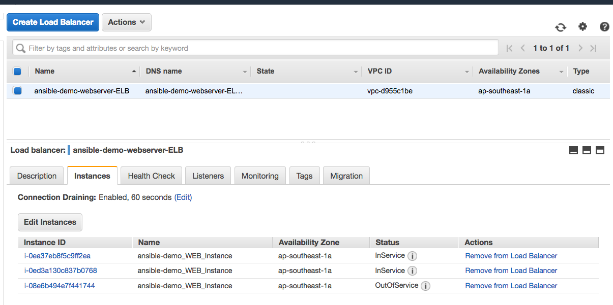
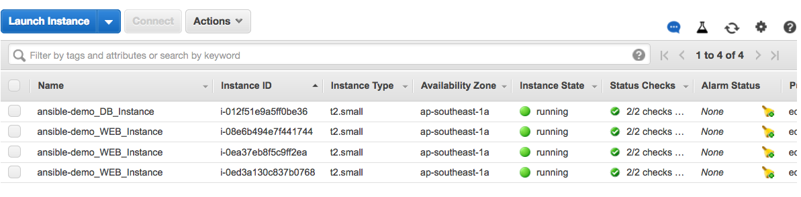
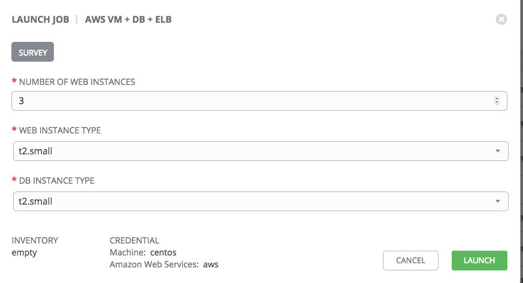

#Introduction

This example provisions a 2-tier archiecture on AWS fronted by an ELB.

## Web

Web instance is installed with PHP with a sample `index.php` that points to the db instance.

## DB

The db instance is installed with MariaDB and is configured with a sample database.

## ElB

All the web instances are added to the ELB

# Ansible Tower

# Other Playbooks
* `patch-example.yml`: This peforms a rolling update by removing an instance at a time from the ELB

