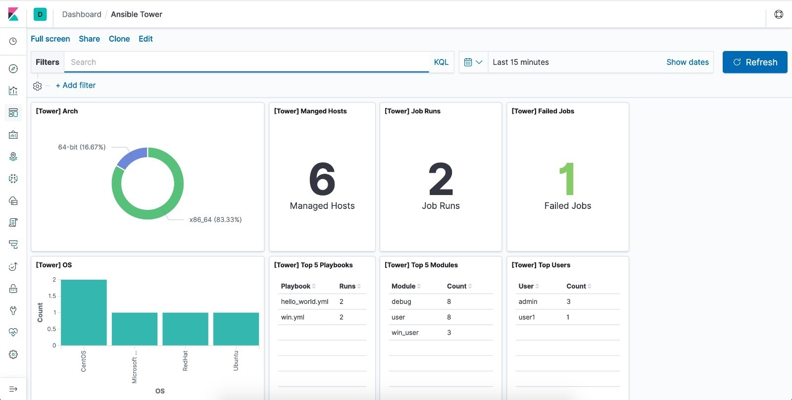
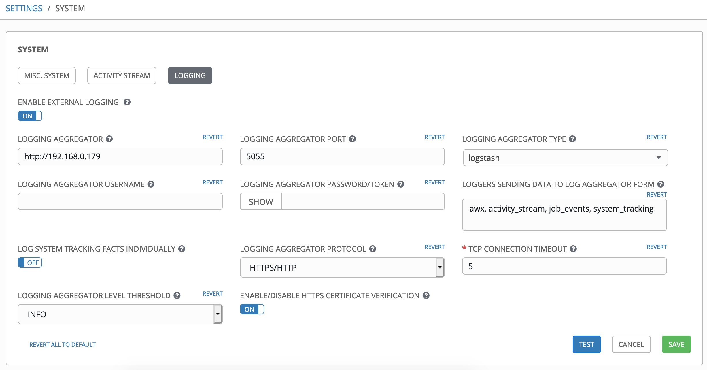

# Log forwarding to ELK stack

## Requirements

Install Red Hat Enterprise Linux 7 or CentOS 7. 

## Installation steps

The playbook will install ELK on a single vm, configure Logstash and load in a sample dashboard/visualization into Kibana.
  ```
  $ ansible-galaxy install -r playbook/requirements.yml 
  $ ansible-playbook playbook/install-elk.yml 
  ```

You should get a sample dashboard on Kibana:


## Configure Tower

Under Settings -> System -> Logging. Fill up the following fields
- Logging Aggregator: http://logstash.hostname
- Logging Aggregator Port: 5055
- Logging Aggregator Type: logstash


